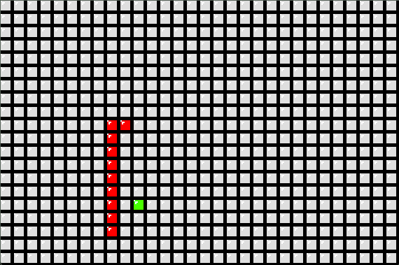
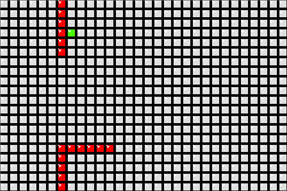

# SnakeGame-using-SFML
This is a snake Game made with SFML and CPP. In this you have to control the snake so that it can eat food without touching itself. As the snake eats food it will grow in size and the difficulty of the control increases.

# Features
- Keyboard inputs
- Random food Generation
- Dynamic grid genertaion
- Customizable code architecture
- Death Condition implemented
- Snake Screen wraping implemented

# ScreenShots

